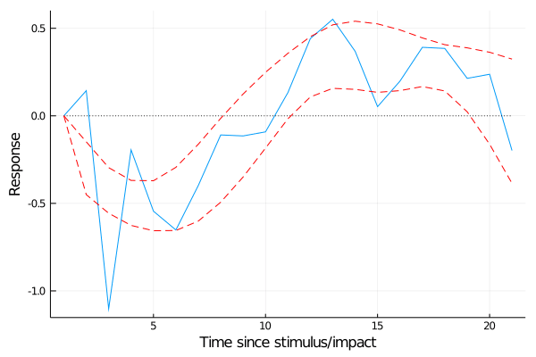
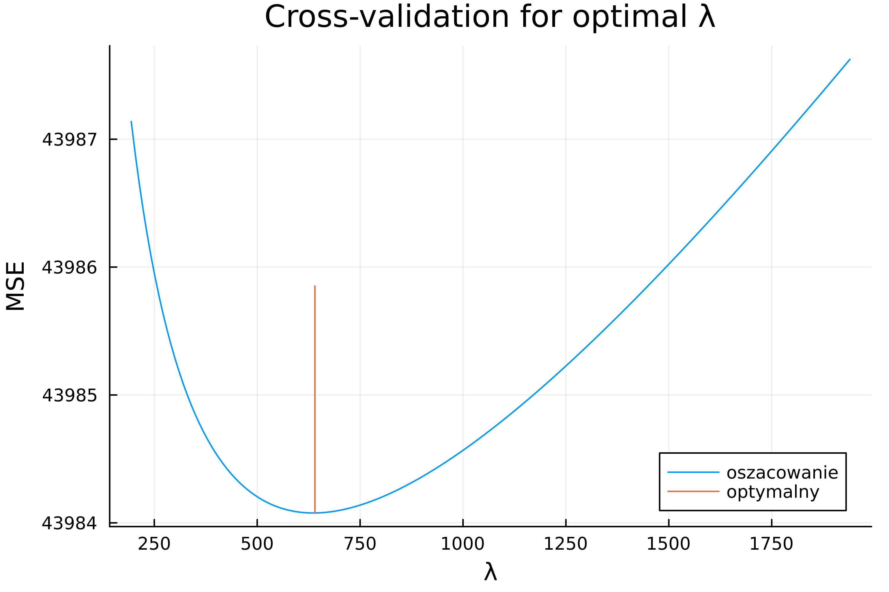

# Smooth local projections (SLP)

[](https://github.com/justinjjleee/SmoothLocalProjections.jl/actions/workflows/CI.yml?query=branch%3Amaster)

Implementation of Smooth Local Projections (SLP) based on [Barnichon and Brownlees (2019)](https://www.mitpressjournals.org/doi/abs/10.1162/rest_a_00778) - "Impulse Response Estimation by Smooth Local Projections." Original method of Local Projections is first introduced by [Òscar Jordà (2005)](https://www.aeaweb.org/articles?id=10.1257/0002828053828518)

The code was translated from MATLAB code published from the replication file made available by [C. Brownlees](https://github.com/ctbrownlees/MATLAB-package-lproj).

```julia
import Pkg;
Pkg.update();

using CSV, Statistics, LinearAlgebra: I;
cd(@__DIR__) #src location

include("functions.jl")
```

Input argument is constructed using a mutable object of following,

```julia
df = CSV.read("data.csv", DataFrame);
df = convert(Array{Float16}, df[:, 2:4]);
# Or
#df = Matrix(df[:, 2:4]);
T, k = size(df);

## Parameterization
P = 4; # Number of lags used in LP - controlled variable

# start LP at H_min=0 or 1 (H_min=1 if impose no contemporanous impact)
H_max = 20;
ind_response = 1; # Endogenous variable - response
ind_shock    = 3; # Endogenous variable related to the shock

# Packaing everything as input
r = 2; #(r-1)=order of the limit polynomial
# NOTE: (so r=2 implies the IR is shrunk towards a line )
λ = 100; 

indx     = [ind_response ind_shock H_max P];

inicjał₀ = initalz(df, indx, "reg", [r 0]);
inicjał₁ = initalz(df, indx, "smooth", [r λ]);
# Obliczanie projekcja lokalna, in order of,
#  (1) Local projection a la Jordá (2005)
#  (2) Local projection with basic parameteri tested
#  (3) Local projection with optimal parameter validated
lp₀, lp₁ = slp(inicjał₀), slp(inicjał₁);

# Cross-valudation for value of optimal value of λ → λₒ
λₒ, resvec = slpᵥ(lp₁);

# Optimal parameter
inicjał₂ = initalz(df, indx, "smooth", [r λₒ]);
lp₂ = slp(inicjał₂);
lp₂_ci = slp_ci(lp₂);
```
Each stripped sub/co-routine is a plot of impulse response functions, (1 - blue line) local projection using [Òscar Jordà (2005)](https://www.aeaweb.org/articles?id=10.1257/0002828053828518); (2 - purple line) smoothed local projection using (λ = 100, for example presented below); (3 - red lines) smoothed local projection using optimal λ estimated using cross-validation method as shown in [Barnichon and Brownlees (2019)](https://www.mitpressjournals.org/doi/abs/10.1162/rest_a_00778) (red solid line is a point estimate, dashed red lines are estimated 90% confidence set).

Following example is a replication of [Barnichon and Brownlees (2019)](https://www.mitpressjournals.org/doi/abs/10.1162/rest_a_00778) estimation of the impulse response of Gross Domestic Product (GDP) to identified positive monetary policy shock.



```julia

# rezultat 
plot(lp₀.IR, xlabel = "Time since stimulus/impact", ylabel = "Response", label = "Jordà (2005)")
plot!(lp₁.IR, label = "SLP: λ = $(λ)", color = "purple")
plot!(zeros(length(lp₁.IR)), label = false, color = "black", line = :dot)
plot!(lp₂.IR, label = "SLP: λ optymalny = $(λₒ)", color = "red")
plot!(lp₂_ci, line = :dash, color = "red", legend = false)

# fantazyjny 
function plt_anime(ir₁, ir₂, iter)
    plot!(ir₁.IR[1:iter], label = "SLP: λ = $(λ)", color = "purple")
    plot!(ir₂.IR[1:iter], label = "SLP: λ optymalny = $(λₒ)", color = "red")
end

plot(lp₀.IR, xlabel = "Time since stimulus/impact", ylabel = "Response", label = "Jordà (2005)")
plot!(zeros(length(lp₁.IR)), label = false, color = "black", line = :dot)
plot!(lp₂_ci, line = :dash, color = "red", legend = false)
fantazyjny = @animate for iter ∈ 1:length(lp₁.IR)
    plt_anime(lp₁, lp₂, iter)
end

gif(fantazyjny, "example.gif", fps = 5)
```

To estimate the optimal parameter, 

```julia
# Optimal parameter evaluation
# walidacja krzyżowa dla optymalny
plt = plot(resvec[:,1], resvec[:,2],
    title = "Cross-validation for optimal λ",
    xlabel = "λ",
    ylabel = "MSE",
    label = "oszacowanie", dpi=500)
param_min = minimum(resvec[:,2]) 
param_bound = minimum(resvec[:,2]) + 
  ((maximum(resvec[:,2])-minimum(resvec[:,2]))/2)
plot!((λₒ .* ones(2, 1)),
      [param_min param_bound]',
      label = "optymalny"
      )
savefig("param_optimal.png")
```