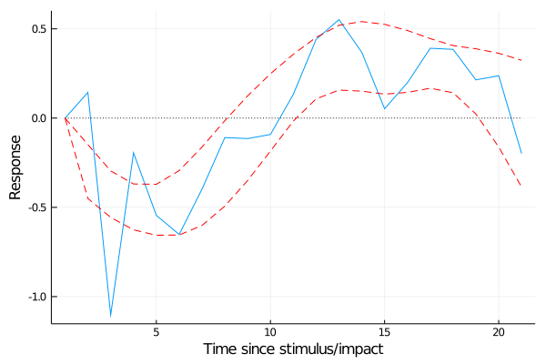
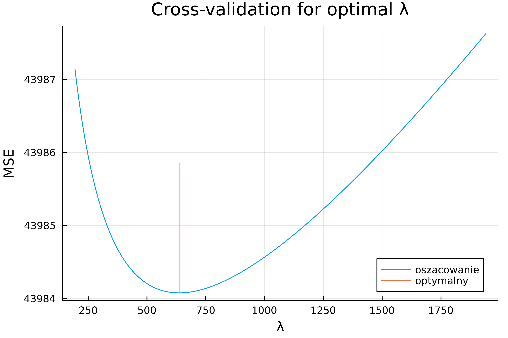
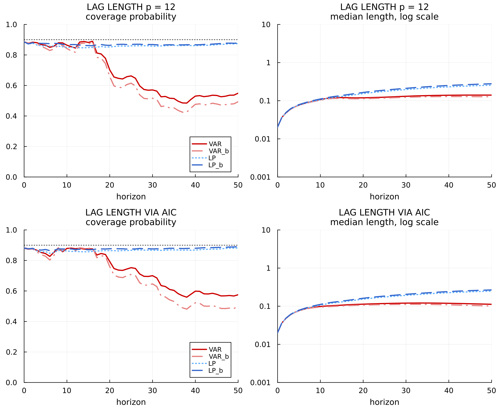

# Local Projections & Robust Macroeconometrics

If you find this work useful, please star this repository!

[](https://github.com/justinjjlee/SmoothLocalProjections "Go to GitHub repo")
[](https://github.com/justinjjlee/SmoothLocalProjections)
[](https://github.com/justinjjlee/SmoothLocalProjections)

Thisis a Julia toolkit for modern impulse response analysis in empirical macroeconomics and time-series econometrics. The repository contains two core components:

1. **Smooth Local Projections (SLP)**: An implementation of penalized B-spline local projections based on [Barnichon and Brownlees (2019)](https://doi.org/10.1162/rest_a_00778), regularizing unconstrained local projections ([Jordà, 2005](https://doi.org/10.1257/0002828053828518)) toward a low-order polynomial curve to reduce variance.
2. **Double Robustness & Misspecification Suite**: A comprehensive analytical, empirical, and simulation replication toolkit for **[Montiel Olea, Plagborg-Møller, Qian, and Wolf (2026, *Econometrica*)](https://doi.org/10.3982/ECTA23345)** (*"Double Robustness of Local Projections and Some Unpleasant VARithmetic"*), examining the robust coverage of local projections vs. fragility of SVARs under dynamic misspecification.

---

## 1. Smooth Local Projections (Barnichon & Brownlees, 2019)

Implementation of Smooth Local Projections (SLP) based on [Barnichon and Brownlees (2019)](https://www.mitpressjournals.org/doi/abs/10.1162/rest_a_00778) - *"Impulse Response Estimation by Smooth Local Projections."* The original method of Local Projections was introduced by [Òscar Jordà (2005)](https://www.aeaweb.org/articles?id=10.1257/0002828053828518).

The code was translated from MATLAB code published from the replication archive made available by [C. Brownlees](https://github.com/ctbrownlees/MATLAB-package-lproj).

### Basic Setup

```julia
import Pkg;
Pkg.update();

using CSV, Statistics, LinearAlgebra: I;
cd(@__DIR__) #src location

include("functions.jl")
```

### Parameterization & Estimation

Input argument is constructed using a mutable object of the following:

```julia
df = CSV.read("data.csv", DataFrame);
df = convert(Array{Float16}, df[:, 2:4]);
# Or
#df = Matrix(df[:, 2:4]);
T, k = size(df);

## Parameterization
P = 4; # Number of lags used in LP - controlled variable

# start LP at H_min=0 or 1 (H_min=1 if impose no contemporanous impact)
H_max = 20;
ind_response = 1; # Endogenous variable - response
ind_shock    = 3; # Endogenous variable related to the shock

# Packaging everything as input
r = 2; #(r-1)=order of the limit polynomial
# NOTE: (so r=2 implies the IR is shrunk towards a line )
λ = 100; 

indx     = [ind_response ind_shock H_max P];

inicjał₀ = initalz(df, indx, "reg", [r 0]);
inicjał₁ = initalz(df, indx, "smooth", [r λ]);
# Obliczanie projekcja lokalna, in order of,
#  (1) Local projection a la Jordá (2005)
#  (2) Local projection with basic parameteri tested
#  (3) Local projection with optimal parameter validated
lp₀, lp₁ = slp(inicjał₀), slp(inicjał₁);

# Cross-valudation for value of optimal value of λ → λₒ
λₒ, resvec = slpᵥ(lp₁);

# Optimal parameter
inicjał₂ = initalz(df, indx, "smooth", [r λₒ]);
lp₂ = slp(inicjał₂);
lp₂_ci = slp_ci(lp₂);
```

Each stripped sub/co-routine produces an impulse response function:
1. **Blue line**: Standard unconstrained local projection ([Òscar Jordà, 2005](https://www.aeaweb.org/articles?id=10.1257/0002828053828518)).
2. **Purple line**: Smoothed local projection using fixed shrinkage ($\lambda = 100$).
3. **Red line**: Smoothed local projection using optimal shrinkage $\lambda_{\mathrm{opt}}$ selected via cross-validation as in [Barnichon and Brownlees (2019)](https://www.mitpressjournals.org/doi/abs/10.1162/rest_a_00778) (solid red line is point estimate, dashed red lines are estimated 90% confidence bands).

### Empirical Example: Monetary Policy Shock

The following example is a replication of the [Barnichon and Brownlees (2019)](https://www.mitpressjournals.org/doi/abs/10.1162/rest_a_00778) estimation of the impulse response of Gross Domestic Product (GDP) to an identified positive monetary policy shock:



```julia
# rezultat 
plot(lp₀.IR, xlabel = "Time since stimulus/impact", ylabel = "Response", label = "Jordà (2005)")
plot!(lp₁.IR, label = "SLP: λ = $(λ)", color = "purple")
plot!(zeros(length(lp₁.IR)), label = false, color = "black", line = :dot)
plot!(lp₂.IR, label = "SLP: λ optymalny = $(λₒ)", color = "red")
plot!(lp₂_ci, line = :dash, color = "red", legend = false)

# fantazyjny 
function plt_anime(ir₁, ir₂, iter)
    plot!(ir₁.IR[1:iter], label = "SLP: λ = $(λ)", color = "purple")
    plot!(ir₂.IR[1:iter], label = "SLP: λ optymalny = $(λₒ)", color = "red")
end

plot(lp₀.IR, xlabel = "Time since stimulus/impact", ylabel = "Response", label = "Jordà (2005)")
plot!(zeros(length(lp₁.IR)), label = false, color = "black", line = :dot)
plot!(lp₂_ci, line = :dash, color = "red", legend = false)
fantazyjny = @animate for iter ∈ 1:length(lp₁.IR)
    plt_anime(lp₁, lp₂, iter)
end

gif(fantazyjny, "example.gif", fps = 5)
```

### Cross-Validation for Optimal Smoothing $\lambda$



```julia
# Optimal parameter evaluation
# walidacja krzyżowa dla optymalny
plt = plot(resvec[:,1], resvec[:,2],
    title = "Cross-validation for optimal λ",
    xlabel = "λ",
    ylabel = "MSE",
    label = "oszacowanie", dpi=500)
param_min = minimum(resvec[:,2]) 
param_bound = minimum(resvec[:,2]) + 
  ((maximum(resvec[:,2])-minimum(resvec[:,2]))/2)
plot!((λₒ .* ones(2, 1)),
      [param_min param_bound]',
      label = "optymalny"
      )
savefig("param_optimal.png")
```

---

## 2. Double Robustness & Misspecification Suite (*Econometrica*, 2026)

Located in [`sim/econometrica_opew/`](sim/econometrica_opew/), this suite provides a standalone, fully verified Julia replication of:

> **Montiel Olea, José Luis, Mikkel Plagborg-Møller, Eric Qian, and Christian K. Wolf (2026)**.  
> *"Double Robustness of Local Projections and Some Unpleasant VARithmetic"*,  
> **Econometrica**, Vol. 94, No. 4 (July, 2026), pp. 1313–1343.  
> Replication Archive: [DOI: 10.5281/zenodo.18474309](https://doi.org/10.5281/zenodo.18474309) | Paper: [DOI: 10.3982/ECTA23345](https://doi.org/10.3982/ECTA23345).

### Key Econometric Findings

1. **Double Robustness of LP**: Conventional LP confidence intervals maintain valid nominal asymptotic coverage even under statistically detectable dynamic misspecification drifting at rate $T^{-\zeta}$ for $\zeta > 1/4$. Its asymptotic bias is second-order ($O_p(T^{-2\zeta})$) because omitted-variable bias in the outcome regression multiplies against omitted-variable bias in the residualized shock regressor.
2. **Fragility of SVARs**: Conventional SVAR confidence intervals with short or moderate lag lengths suffer substantial undercoverage (often dropping below 50% or even toward 0%) under plausible, local dynamic misspecification that is statistically undetectable via standard specification tests.
3. **The "Unpleasant VARithmetic"**: A conventional VAR confidence interval is asymptotically robust to misspecification if and only if its lag length is chosen so large that its asymptotic variance inflates to match that of the LP interval. If a VAR interval is substantially narrower than an LP interval, it is inherently fragile.
4. **Bias-Aware Corrections**: Constructing minimax bias-aware confidence intervals ([Armstrong and Kolesár, 2021](https://doi.org/10.1257/qe.20190364)) that guarantee nominal coverage under misspecification bound $M$ widens the VAR intervals, neutralizing any efficiency advantage over LP.

### Replicated Simulation: Oil Supply News Shock (Känzig, 2021)

The Monte Carlo simulation calibrates a ground-truth $\mathrm{VAR}(18)$ DGP on the 7-variable system of [Diego R. Känzig (2021, *AER*)](https://doi.org/10.1257/aer.20191823) ($T = 720$ months, oil proxy shock ordered first). It compares nominal 90% confidence intervals from $\mathrm{VAR}(12)$, $\mathrm{VAR}(\mathrm{AIC})$, $\mathrm{LP}(12)$, and $\mathrm{LP}(\mathrm{AIC})$:



- **Coverage**: As horizon $h$ increases, VAR coverage deteriorates from ~88% at $h=0$ to ~54% ($p=12$) and ~57% (AIC) at $h=50$, while LP intervals maintain nominal ~88% coverage across all horizons.
- **Length**: Although VAR intervals are narrower at long horizons (ratio $\approx 0.55$), that precision comes at the expense of severe undercoverage due to accumulated lag misspecification.

### Replication Suite Execution

All scripts can be executed directly using the project environment:

```bash
# 1. Analytical Curves: Figures 1, 2, 3, 5, 6, 7 (Worst-case coverage, bias-aware length, minimax weights)
julia --project=. sim/econometrica_opew/scripts/replicate_paper_figures.jl

# 2. Section 5.1 Literature Survey: 81 macro papers lag selection distribution
julia --project=. sim/econometrica_opew/scripts/replicate_lit_survey.jl

# 3. Section 4.2 Standard Error Ratios: 301 empirical estimates from Ramey (2016)
julia --project=. sim/econometrica_opew/scripts/replicate_ramey_summary.jl

# 4. Generate Main & Appendix Simulation Plots (Figure 4 & Figure D.1)
julia --project=. sim/econometrica_opew/scripts/plot_simulation_figures.jl
```

For the complete theoretical derivation, companion form algebra, Lyapunov solvers, and numerical verification tables, see the [Econometrica Replication Master Guide](sim/econometrica_opew/README.md).

### Connection to Smooth Local Projections

Smooth Local Projections ([Barnichon and Brownlees, 2019](https://doi.org/10.1162/rest_a_00778)) directly bridge the trade-off identified by Montiel Olea et al. (2026):
- As penalty parameter $\lambda \to 0$, SLP converges to unconstrained LP, inheriting full double robustness and nominal coverage under misspecification.
- As $\lambda \to \infty$, SLP regularizes the response toward a low-order polynomial, shrinking estimation variance across horizons.

---

## References

- **Barnichon, Regis, and Christian Brownlees (2019)**. *"Impulse Response Estimation by Smooth Local Projections."* *Review of Economics and Statistics*, 101(3), pp. 522–530.
- **Jordà, Òscar (2005)**. *"Estimation and Inference of Impulse Responses by Local Projections."* *American Economic Review*, 95(1), pp. 161–182.
- **Känzig, Diego R. (2021)**. *"The Macroeconomic Effects of Oil Supply News: Evidence from OPEC Announcements."* *American Economic Review*, 111(4), pp. 1092–1125.
- **Montiel Olea, José Luis, Mikkel Plagborg-Møller, Eric Qian, and Christian K. Wolf (2026)**. *"Double Robustness of Local Projections and Some Unpleasant VARithmetic."* *Econometrica*, 94(4), pp. 1313–1343.
- **Ramey, Valerie A. (2016)**. *"Macroeconomic Shocks and Their Consequences."* *Handbook of Macroeconomics*, Vol. 2, pp. 71–162.
